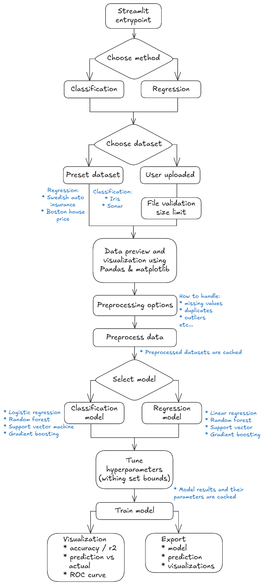

<div style="display: flex; align-items: flex-start;">

<div style="flex: 1; margin-right: 20px;">

# Interactive Streamlit Machine Learning Tool
### IN PROGRESS

This Streamlit application provides an interactive platform for trying out multiple machine learning models on either preset or your datasets.

## 🚀 Features
- **Model Comparison**: Test 8 different algorithms
- **Provided Datasets**: Test on 1 out of 4 provided datasets, or your own
- **Smart Preprocessing**: Automated data cleaning
- **Hyperparameter Tuning**: Try out different model parameters
- **Performance Caching**: Redis-powered result storage
- **Export Results**: Download models and reports

## 🛠️ Tech Stack
- Python 3.11
- Streamlit
- Scikit-learn
- Redis
- Docker

## ⚡ Quick Start
1. Clone the repository
```bash
git clone git@github.com:JeppesS1423/streamlit-ml-lab.git
cd streamlit-ml-lab
```

2. Start the application
```bash
docker-compose up --build
```

</div>

<div style="flex: 1;">

# Application Flowchart



</div>

</div>

